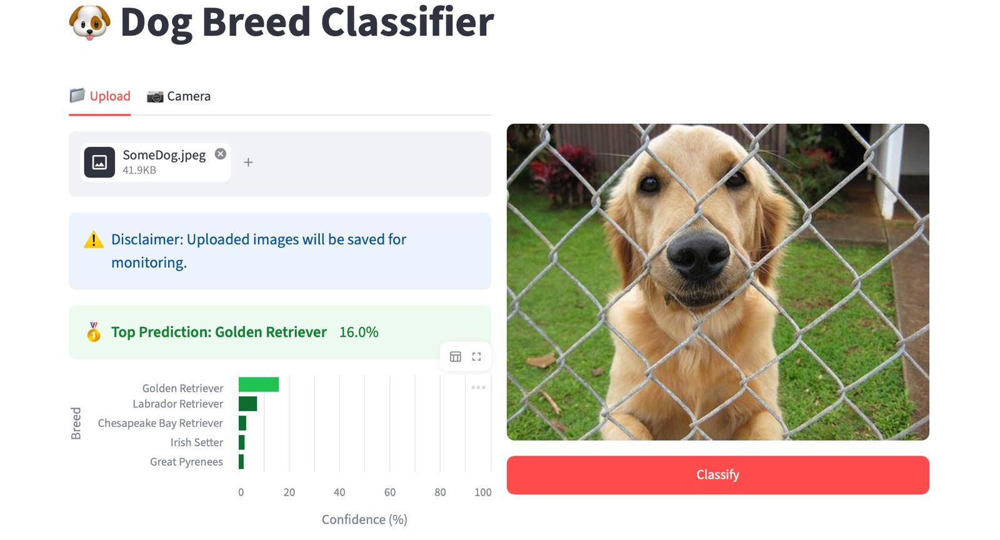

# dogs_classification

Classifier of dog breeds.

## Project links

You can access the application here:
[Go to the App](https://dogs-frontend-288634047169.europe-west4.run.app/)

Project documentation is available here:
[View the Documentation](https://hiwicip.github.io/mlops_dogs_classification/)



## Project description

This Machine Learning project is an end-to-end MLOps application for classifying dog breeds from images.
The core model is a pretrained Vision Transformer, `google/vit-base-patch16-224`, that we fine-tune with PyTorch Lightning for multi-class breed classification.
We use the labelled [Stanford Dogs dataset](http://vision.stanford.edu/aditya86/ImageNetDogs/) (120 breeds total) and train on a curated subset of 80 breeds for this project.


## Project structure

The directory structure of the project looks like this:
```txt
├── .github/                  # Github actions and dependabot
│   ├── dependabot.yaml
│   └── workflows/
│       ├── cml_data.yaml
│       ├── deploy_docs.yaml
│       ├── linting.yaml
│       ├── stage_model.yaml
│       └── tests.yaml
├── configs/                  # Configuration files
├── cloud/                    # Cloud deployment files
│   ├── cleanup_policy.json
│   ├── cloudbuild_bentoml.yaml
│   ├── cloudbuild_evaluate.yaml
│   ├── cloudbuild_frontend.yaml
│   ├── cloudbuild_train.yaml
│   ├── config_gpu.yaml
│   ├── run-monitoring.yaml
│   ├── run-service.yaml
│   └── vertex_ai_train.yaml
├── data/                     # Data directory
│   ├── processed
│   └── raw
├── dockerfiles/              # Dockerfiles
│   ├── api.dockerfile
│   ├── bentoml.dockerfile
│   ├── data.dockerfile
│   ├── evaluate.dockerfile
│   ├── frontend.dockerfile
│   └── train.dockerfile
├── docs/                     # Documentation
│   ├── mkdocs.yml
│   └── source/
│       ├── docs.md
│       └── index.md
├── models/                   # Trained models
├── outputs/                  # Hydra outputs
├── reports/                  # Reports
│   └── figures/
├── src/                      # Source code
│   └── dogs_classification/
│       ├── __init__.py
│       ├── bentoml.py
│       ├── create_onnx.py
│       ├── data.py
│       ├── data_drift.py
│       ├── dataset_statistics.py
│       ├── evaluate.py
│       ├── frontend.py
│       ├── link_model.py
│       ├── model.py
│       ├── train.py
│       └── visualize.py
└── tests/                    # Tests
│   ├── performancetests
│   │   ├── locustfile.py
│   │   └── test_model.py
│   ├── test_bentoml.py
│   ├── test_data.py
│   ├── test_model.py
│   └── test_train.py
├── wandb/                    # Weights and Biases files
├── .gitignore
├── .pre-commit-config.yaml
├── .python-version
├── LICENSE
├── pyproject.toml            # Python project file
├── README.md                 # Project README
├── tasks.py                  # Project tasks
└── uv.lock
```


Created using [mlops_template](https://github.com/SkafteNicki/mlops_template),
a [cookiecutter template](https://github.com/cookiecutter/cookiecutter) for getting
started with Machine Learning Operations (MLOps).
