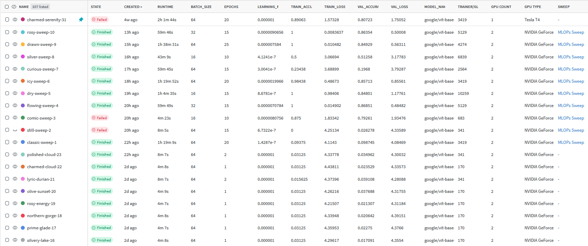
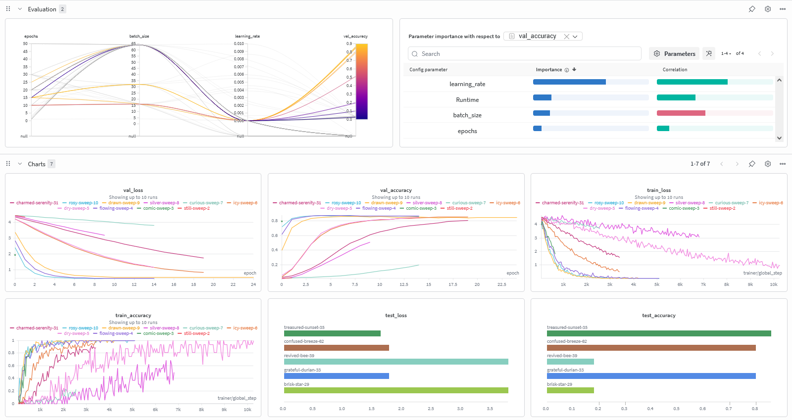
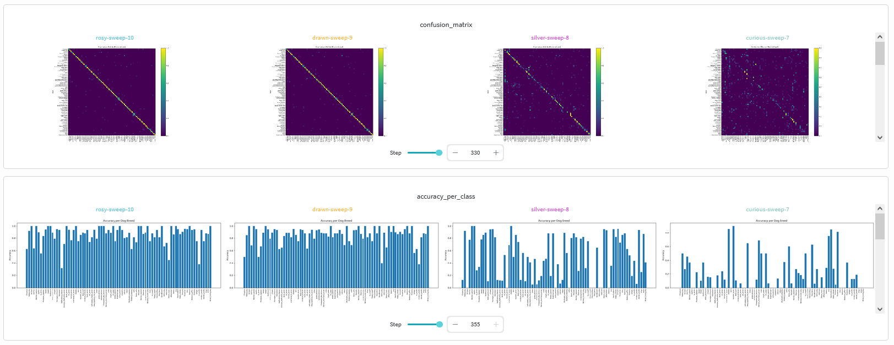
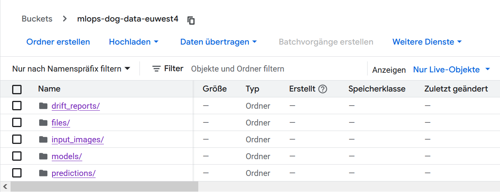
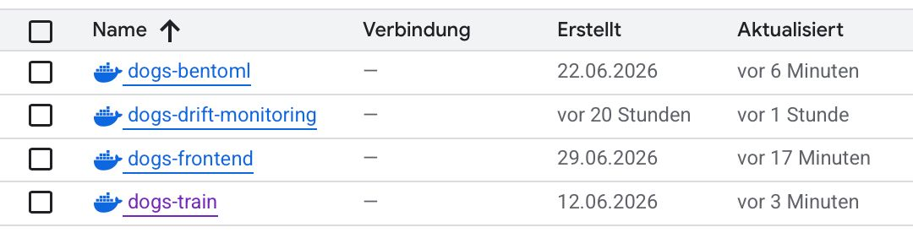
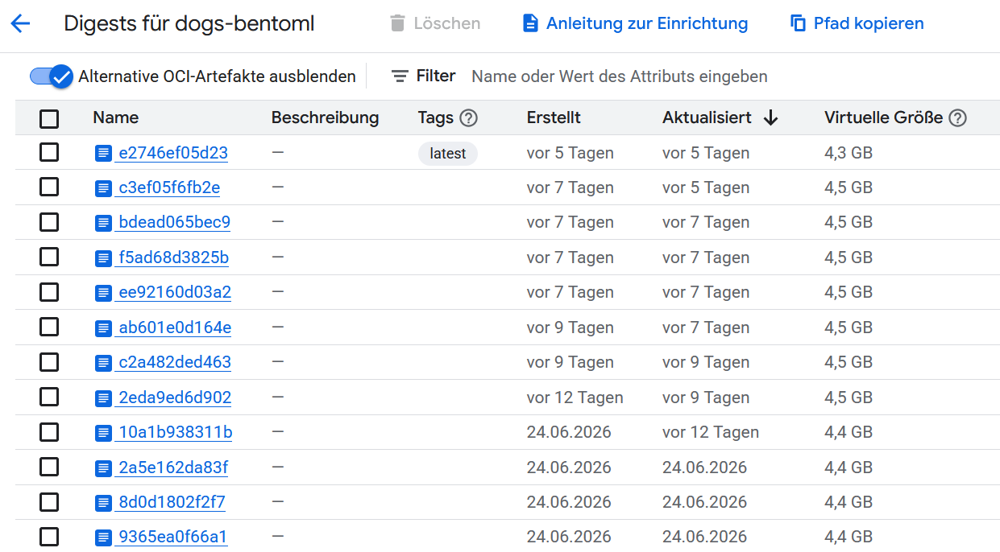
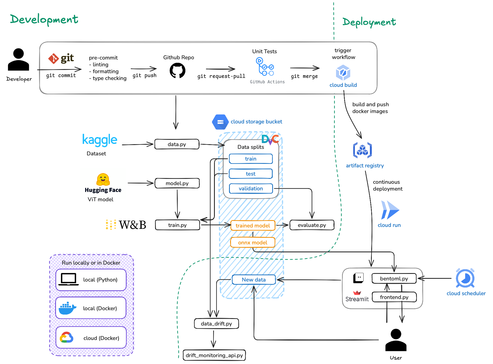

# Exam template for 02476 Machine Learning Operations

This is the report template for the exam. Please only remove the text formatted as with three dashes in front and behind
like:

```--- question 1 fill here ---```

Where you instead should add your answers. Any other changes may have unwanted consequences when your report is
auto-generated at the end of the course. For questions where you are asked to include images, start by adding the image
to the `figures` subfolder (please only use `.png`, `.jpg` or `.jpeg`) and then add the following code in your answer:

``

In addition to this markdown file, we also provide the `report.py` script that provides two utility functions:

Running:

```bash
python report.py html
```

Will generate a `.html` page of your report. After the deadline for answering this template, we will auto-scrape
everything in this `reports` folder and then use this utility to generate a `.html` page that will be your serve
as your final hand-in.

Running

```bash
python report.py check
```

Will check your answers in this template against the constraints listed for each question e.g. is your answer too
short, too long, or have you included an image when asked. For both functions to work you mustn't rename anything.
The script has two dependencies that can be installed with

```bash
pip install typer markdown
```

or

```bash
uv add typer markdown
```

## Overall project checklist

The checklist is *exhaustive* which means that it includes everything that you could do on the project included in the
curriculum in this course. Therefore, we do not expect at all that you have checked all boxes at the end of the project.
The parenthesis at the end indicates what module the bullet point is related to. Please be honest in your answers, we
will check the repositories and the code to verify your answers.

### Week 1

* [X] Create a git repository (M5)
* [X] Make sure that all team members have write access to the GitHub repository (M5)
* [X] Create a dedicated environment for you project to keep track of your packages (M2)
* [X] Create the initial file structure using cookiecutter with an appropriate template (M6)
* [X] Fill out the `data.py` file such that it downloads whatever data you need and preprocesses it (if necessary) (M6)
* [X] Add a model to `model.py` and a training procedure to `train.py` and get that running (M6)
* [X] Remember to either fill out the `requirements.txt`/`requirements_dev.txt` files or keeping your
    `pyproject.toml`/`uv.lock` up-to-date with whatever dependencies that you are using (M2+M6)
* [ ] Remember to comply with good coding practices (`pep8`) while doing the project (M7)
* [ ] Do a bit of code typing and remember to document essential parts of your code (M7)
* [x] Setup version control for your data or part of your data (M8)
* [ ] Add command line interfaces and project commands to your code where it makes sense (M9)
* [ ] Construct one or multiple docker files for your code (M10)
* [ ] Build the docker files locally and make sure they work as intended (M10)
* [x] Write one or multiple configurations files for your experiments (M11)
* [x] Used Hydra to load the configurations and manage your hyperparameters (M11)
* [X] Use profiling to optimize your code (M12)
* [X] Use logging to log important events in your code (M14)
* [X] Use Weights & Biases to log training progress and other important metrics/artifacts in your code (M14)
* [X] Consider running a hyperparameter optimization sweep (M14)
* [X] Use PyTorch-lightning (if applicable) to reduce the amount of boilerplate in your code (M15)

### Week 2

* [X] Write unit tests related to the data part of your code (M16)
* [X] Write unit tests related to model construction and or model training (M16)
* [X] Calculate the code coverage (M16)
* [x] Get some continuous integration running on the GitHub repository (M17)
* [x] Add caching and multi-os/python/pytorch testing to your continuous integration (M17)
* [x] Add a linting step to your continuous integration (M17)
* [x] Add pre-commit hooks to your version control setup (M18)
* [X] Add a continues workflow that triggers when data changes (M19)
* [X] Add a continues workflow that triggers when changes to the model registry is made (M19)
* [x] Create a data storage in GCP Bucket for your data and link this with your data version control setup (M21)
* [X] Create a trigger workflow for automatically building your docker images (M21)
* [X] Get your model training in GCP using either the Engine or Vertex AI (M21)
* [X] Create a FastAPI application that can do inference using your model (M22)
* [X] Deploy your model in GCP using either Functions or Run as the backend (M23)
* [X] Write API tests for your application and setup continues integration for these (M24)
* [ ] Load test your application (M24)
* [X] Create a more specialized ML-deployment API using either ONNX or BentoML, or both (M25)
* [X] Create a frontend for your API (M26)

### Week 3

* [X] Check how robust your model is towards data drifting (M27)
* [X] Setup collection of input-output data from your deployed application (M27)
* [X] Deploy to the cloud a drift detection API (M27)
* [X] Instrument your API with a couple of system metrics (M28)
* [ ] Setup cloud monitoring of your instrumented application (M28)
* [ ] Create one or more alert systems in GCP to alert you if your app is not behaving correctly (M28)
* [X] If applicable, optimize the performance of your data loading using distributed data loading (M29)
* [ ] If applicable, optimize the performance of your training pipeline by using distributed training (M30)
* [X] Play around with quantization, compilation and pruning for you trained models to increase inference speed (M31)

### Extra

* [x] Write some documentation for your application (M32)
* [X] Publish the documentation to GitHub Pages (M32)
* [ ] Revisit your initial project description. Did the project turn out as you wanted?
* [X] Create an architectural diagram over your MLOps pipeline
* [ ] Make sure all group members have an understanding about all parts of the project
* [X] Uploaded all your code to GitHub

## Group information

### Question 1
> **Enter the group number you signed up on <learn.inside.dtu.dk>**
>
> Answer:

--- question 1 fill here ---

### Question 2
> **Enter the study number for each member in the group**
>
> Example:
>
> *sXXXXXX, sXXXXXX, sXXXXXX*
>
> Answer:

--- question 2 fill here ---

### Question 3
> **Did you end up using any open-source frameworks/packages not covered in the course during your project? If so**
> **which did you use and how did they help you complete the project?**
>
> Recommended answer length: 0-200 words.
>
> Example:
> *We used the third-party framework ... in our project. We used functionality ... and functionality ... from the*
> *package to do ... and ... in our project*.
>
> Answer:

We did use an open-source package that was not covered in the course: Hugging Face Transformers. In particular, we used the pretrained ViT model `google/vit-base-patch16-224` together with `AutoImageProcessor` and `ViTForImageClassification` to build the image classification pipeline. This helped us reuse a strong pretrained vision backbone instead of training a model from scratch.

## Coding environment

> In the following section we are interested in learning more about you local development environment. This includes
> how you managed dependencies, the structure of your code and how you managed code quality.

### Question 4

> **Explain how you managed dependencies in your project? Explain the process a new team member would have to go**
> **through to get an exact copy of your environment.**
>
> Recommended answer length: 100-200 words
>
> Example:
> *We used ... for managing our dependencies. The list of dependencies was auto-generated using ... . To get a*
> *complete copy of our development environment, one would have to run the following commands*
>
> Answer:

We used uv to manage our dependencies. All project dependencies are declared in the pyproject.toml file. The corresponding uv.lock file ensures that every team member installs exactly the same package versions. This file was was auto-generated and is updated whenever we added or removed packages from our environment. We added packages to our environment using the command `uv add <package>`.
In the pyproject.toml file we separated dependencies into optional groups (train, serve, frontend and cloud) so that our Docker images only install the packages required for their specific purpose, reducing both image size and build time.
Since we locally need all dependencies, we installed all optional groups with `uv sync --all-extras`. We run this command every time we added or updated a package to our environment.
Whenever we start working on our code, we ensure being in the right virtual environment by running `source .venv/bin/activate`.

To get a complete copy of our development environment, one would have to run the following commands:

```bash
uv venv --python 3.13
uv sync --all-extras
```

### Question 5

> **We expect that you initialized your project using the cookiecutter template. Explain the overall structure of your**
> **code. What did you fill out? Did you deviate from the template in some way?**
>
> Recommended answer length: 100-200 words
>
> Example:
> *From the cookiecutter template we have filled out the ... , ... and ... folder. We have removed the ... folder*
> *because we did not use any ... in our project. We have added an ... folder that contains ... for running our*
> *experiments.*
>
> Answer:

From the cookiecutter template we have filled out the `.github`, `configs`, `dockerfiles`, `docs`, `models`, `src` and `tests` folders. We removed the `notebooks` folder because we did not use any notebooks in our project. We added a `data` folder for the raw and processed data, a `cloud` folder that mainly contains cloud build files, and also a `logs`, `outputs` and `wandb` folder.

Most of our changes happened inside `src/dogs_classification`, since our project ended up with more scripts than the template originally has. We kept the basic structure: `data.py` downloads the dataset with kagglehub, splits it and defines our `DogDataset` class, `model.py` defines our Lightning module around the pretrained ViT, `train.py` trains it with Hydra configs and W&B logging and `evaluate.py` evaluates the trained model on the test set. On top of that we added several files that are not part of the template: `bentoml.py`, which serves our model as the backend, `frontend.py` for our Streamlit frontend, `create_onnx.py` for the ONNX export, `link_model.py` for staging models in the W&B model registry, and `data_drift.py` and `drift_monitoring_api.py` for drift detection.

### Question 6

> **Did you implement any rules for code quality and format? What about typing and documentation? Additionally,**
> **explain with your own words why these concepts matters in larger projects.**
>
> Recommended answer length: 100-200 words.
>
> Example:
> *We used ... for linting and ... for formatting. We also used ... for typing and ... for documentation. These*
> *concepts are important in larger projects because ... . For example, typing ...*
>
> Answer:

For linting and formatting we mainly used ruff and ruff-format. We also have some basic pre-commit hooks like trailing whitespace and end-of-file-fixer. Ruff is configured with a 120-character line limit and selects a set of rules, which we have found to be good to keep our code clean and readable. They cover pycodestyle, pyflakes, import sorting, and some additional rules.
We also used mypy for typing and docstrings for documentation.
These concepts are important in larger projects to maintain a clean and readable codebase. It makes it easier for team members to understand each other's code. Typing helps catch errors early in the development process and documentation helps to understand the purpose and usage of functions and classes.

## Version control

> In the following section we are interested in how version control was used in your project during development to
> corporate and increase the quality of your code.

### Question 7

> **How many tests did you implement and what are they testing in your code?**
>
> Recommended answer length: 50-100 words.
>
> Example:
> *In total we have implemented X tests. Primarily we are testing ... and ... as these the most critical parts of our*
> *application but also ... .*
>
> Answer:

--- question 7 fill here ---

### Question 8

> **What is the total code coverage (in percentage) of your code? If your code had a code coverage of 100% (or close**
> **to), would you still trust it to be error free? Explain you reasoning.**
>
> Recommended answer length: 100-200 words.
>
> Example:
> *The total code coverage of code is X%, which includes all our source code. We are far from 100% coverage of our **
> *code and even if we were then...*
>
> Answer:

Our total code coverage, computed by running `invoke test`, is 17%, measured over all of `src/dogs_classification`. The coverage is very unevenly distributed: `train.py` is at 97% and `model.py` and `data.py` are partially covered, but many modules like `bentoml.py`, `frontend.py`, `create_onnx.py` and `data_drift.py` are at 0%. Part of the reason is that some of these are tested differently: `bentoml.py` for example is tested through our API tests, which send real HTTP requests to a running BentoML service. Since the service runs in a separate process, the coverage tool does not count any of this as covered.
Even with a coverage close to 100% we would not trust our code to be error free. Coverage only measures which lines were executed during the tests, not whether the behavior is actually correct. A line can be executed without any assertion checking its result, and edge cases or unexpected inputs can still cause errors even if every line was run at least once. Our bentoml.py shows the opposite case: the module is tested quite thoroughly but shows up as 0%. So coverage is useful to see what is untested, but it says little about correctness.

### Question 9

> **Did you workflow include using branches and pull requests? If yes, explain how. If not, explain how branches and**
> **pull request can help improve version control.**
>
> Recommended answer length: 100-200 words.
>
> Example:
> *We made use of both branches and PRs in our project. In our group, each member had an branch that they worked on in*
> *addition to the main branch. To merge code we ...*
>
> Answer:

For every To-Do, we created an issue in GitHub and assigned it to a group member. The person working on the issue created a branch linked to the issue and worked on it. As soon as the work was done, a pull request was created. Linting and unit tests were run automatically and only if all passed, the pull request was stashed and merged into the master branch. The linked issue was then automatically closed. We had a ruleset for our master branch that prohibited direct commits to the master branch, which ensured that all code required creating a pull request and passing the tests before being merged. In addition, to keep our commit history clean, we required that all pull requests were squashed before merging, so we only had one commit per pull request in the master branch.

### Question 10

> **Did you use DVC for managing data in your project? If yes, then how did it improve your project to have version**
> **control of your data. If no, explain a case where it would be beneficial to have version control of your data.**
>
> Recommended answer length: 100-200 words.
>
> Example:
> *We did make use of DVC in the following way: ... . In the end it helped us in ... for controlling ... part of our*
> *pipeline*
>
> Answer:

--- question 10 fill here ---

### Question 11

> **Discuss you continuous integration setup. What kind of continuous integration are you running (unittesting,**
> **linting, etc.)? Do you test multiple operating systems, Python  version etc. Do you make use of caching? Feel free**
> **to insert a link to one of your GitHub actions workflow.**
>
> Recommended answer length: 200-300 words.
>
> Example:
> *We have organized our continuous integration into 3 separate files: one for doing ..., one for running ... testing*
> *and one for running ... . In particular for our ..., we used ... .An example of a triggered workflow can be seen*
> *here: <weblink>*
>
> Answer:

Our continuous integration is organized into 3 parts: linting, testing and automatically building our docker images.
The linting workflow runs on every push to the master branch as well as on pull requests on the master branch. We ensured that the linting tests were also already part of our pre-commit hooks, so that we could catch linting errors before pushing code to the repository and thereby avoid failing the CI workflow.
The testing workflow runs on pull-requests only, but since pull-requests are required to be created before merging code into the master branch, this ensures that all code is tested before being merged. The testing workflow runs on multiple operating systems (Linux, Windows and MacOS) and includes both unit tests and API tests. We also make use of caching by caching the uv downloaded cache and the huggingface model, so that we do not have to download these every time the workflow is run.
We had 4 trigger workflows for automatically building our docker images (training image, evaluation image, backend image and frontend image). These workflows run when merges are made to the master branch, but only if the merge includes changes to the respective files that are used to build the docker images (for example changes to train.py or train.dockerfile for the training docker image).
Moreover, we implemented two continuous Machine Learning workflows. The first runs when changes to the data are made and then comments on the pull request with some data statistics. The other workflow runs when changes to the model registry in W&B are made. If a model is tagged with the alias "staged", then the workflow will run model tests in Github Actions and if the tests pass, the model gets promoted to the alias "production" in W&B.

## Running code and tracking experiments

> In the following section we are interested in learning more about the experimental setup for running your code and
> especially the reproducibility of your experiments.

### Question 12

> **How did you configure experiments? Did you make use of config files? Explain with coding examples of how you would**
> **run a experiment.**
>
> Recommended answer length: 50-100 words.
>
> Example:
> *We used a simple argparser, that worked in the following way: Python  my_script.py --lr 1e-3 --batch_size 25*
>
> Answer:

We used Hydra for configuring our experiments. All hyperparameters (learning rate, batch size, epochs, model name, ...) are stored in YAML files in the `configs/` folder, which are loaded in `train.py` via `@hydra.main`. With Hydra we can override any value from the command line without changing the code. To run an experiment we can use our invoke task:

```bash
uv run invoke train --lr 0.000002 --batch-size 32 --epochs 15
```

or call the training script directly with Hydra syntax:

```bash
uv run src/dogs_classification/train.py training.lr=0.000002 training.batch_size=32
```

We also created a `sweep.yaml` config that we used for W&B hyperparameter sweeps.

### Question 13

> **Reproducibility of experiments are important. Related to the last question, how did you secure that no information**
> **is lost when running experiments and that your experiments are reproducible?**
>
> Recommended answer length: 100-200 words.
>
> Example:
> *We made use of config files. Whenever an experiment is run the following happens: ... . To reproduce an experiment*
> *one would have to do ...*
>
> Answer:

--- question 13 fill here ---

### Question 14

> **Upload 1 to 3 screenshots that show the experiments that you have done in W&B (or another experiment tracking**
> **service of your choice). This may include loss graphs, logged images, hyperparameter sweeps etc. You can take**
> **inspiration from [this figure](figures/wandb.png). Explain what metrics you are tracking and why they are**
> **important.**
>
> Recommended answer length: 200-300 words + 1 to 3 screenshots.
>
> Example:
> *As seen in the first image when have tracked ... and ... which both inform us about ... in our experiments.*
> *As seen in the second image we are also tracking ... and ...*
>
> Answer:





We used Weights & Biases to track our experiments.
The first images shows the last logged runs in W&B with some of the logged metrics.
We tracked the training loss, training accuracy, validation loss and validation accuracy. Charts of these metrics can be seen in the bottom section of the second image. The training loss and accuracy inform us about how well our model is learning during training, while the validation loss and accuracy inform us about how well our model generalizes to unseen data. As seen in the both the first and the second image, some of our models had a training accuracy of 100%. Such models could be overfitting to the training data, which is why we paid more attention to the validation metrics.
We also tracked hyperparameters like learning rate, batch size and epochs. In the upper sections of the second image we compared the validation accuracy of different runs with different hyperparameters. We did multiple hyperparameter sweeps to find the best hyperparameters for our model. Charts like these helped us to visualize the effect of different hyperparameters on the performance of our model.
The third image shows some of the media that we logged in W&B: after each training epoch we logged a confusion matrix and a chart showing the accuracy per class. We also logged some sampled images of the input data and the corresponding model predictions and the true labels (not shown in the screenshot).

### Question 15

> **Docker is an important tool for creating containerized applications. Explain how you used docker in your**
> **experiments/project? Include how you would run your docker images and include a link to one of your docker files.**
>
> Recommended answer length: 100-200 words.
>
> Example:
> *For our project we developed several images: one for training, inference and deployment. For example to run the*
> *training docker image: `docker run trainer:latest lr=1e-3 batch_size=64`. Link to docker file: <weblink>*
>
> Answer:

For our project we developed five docker images, one for each part of the pipeline: `data.dockerfile` for the data preprocessing, `train.dockerfile` for training, `bentoml.dockerfile` for the backend serving the model, `frontend.dockerfile` for the Streamlit frontend and `drift_monitoring_api.dockerfile` for the drift detection service. All images install their dependencies with uv using the frozen lock file and only the optional dependency groups they need, which keeps the builds reproducible and the images smaller. We wrapped building and running the images into invoke tasks. To build and run the training image locally we would run:

```bash
uv run invoke docker-build --image-name trainer --dockerfile dockerfiles/train.dockerfile
uv run invoke docker-run --image trainer
```

The images are also built automatically by Cloud Build triggers whenever the relevant source files change on the default branch. The backend and frontend images are then deployed to Cloud Run, while the training image is used for training jobs in Vertex AI. Link to docker file: <https://github.com/hiwicip/mlops_dogs_classification/blob/master/dockerfiles/train.dockerfile>

### Question 16

> **When running into bugs while trying to run your experiments, how did you perform debugging? Additionally, did you**
> **try to profile your code or do you think it is already perfect?**
>
> Recommended answer length: 100-200 words.
>
> Example:
> *Debugging method was dependent on group member. Some just used ... and others used ... . We did a single profiling*
> *run of our main code at some point that showed ...*
>
> Answer:

--- question 16 fill here ---

## Working in the cloud

> In the following section we would like to know more about your experience when developing in the cloud.

### Question 17

> **List all the GCP services that you made use of in your project and shortly explain what each service does?**
>
> Recommended answer length: 50-200 words.
>
> Example:
> *We used the following two services: Engine and Bucket. Engine is used for... and Bucket is used for...*
>
> Answer:

We used the following GCP services:
- Cloud Storage: We stored our data, trained models, input-output data and drift reports in GCP buckets.
- Secret Manager: We used Secret Manager to store API keys (like the W&B API key).
- Service Account: We created service accounts to give our applications access to the GCP services.
- Compute Engine: We used Compute Engine to run training jobs.
- Vertex AI: We also used Vertex AI to train our models in the cloud. Our final model was trained in Vertex AI.
- Artifact Registry: We stored our docker images in the artifact registry.
- Cloud Build: We used cloud build to automatically build our docker images. We implemented a trigger workflow that automatically builds the respective docker images when changes to the according files are pushed to the main branch.
- Cloud Run: We deployed our Backend and Frontend applications in Cloud Run.
- Cloud Scheduler: We used Cloud Scheduler to schedule a minutely job that pings the backend application to keep it alive and avoid cold starts.
- Cloud Monitoring: We used Cloud Monitoring to track metrics of our deployed services (e.g. request count, latency, memory utilization) and set up alerting policies for high memory utilization, high backend latency and 5xx errors.

### Question 18

> **The backbone of GCP is the Compute engine. Explained how you made use of this service and what type of VMs**
> **you used?**
>
> Recommended answer length: 100-200 words.
>
> Example:
> *We used the compute engine to run our ... . We used instances with the following hardware: ... and we started the*
> *using a custom container: ...*
>
> Answer:

We used Compute Engine in two ways during the project. At the beginning we manually created a VM through the GCP console and used it to run our first training experiments, mainly to get familiar with working on a cloud instance.

Later we switched to Vertex AI custom training jobs for all further training, including our final model. Vertex AI still runs on Compute Engine under the hood, but the instances are provisioned automatically for the duration of the job and shut down afterwards. The machine type we used for these jobs is an `n1-standard-8` instance with an NVIDIA T4 GPU. Instead of setting up the environment manually, the instance runs our training docker image from the Artifact Registry, so all dependencies are already baked in. How the training jobs are submitted is described in Question 22.

### Question 19

> **Insert 1-2 images of your GCP bucket, such that we can see what data you have stored in it.**
> **You can take inspiration from [this figure](figures/bucket.png).**
>
> Answer:



### Question 20

> **Upload 1-2 images of your GCP artifact registry, such that we can see the different docker images that you have**
> **stored. You can take inspiration from [this figure](figures/registry.png).**
>
> Answer:




### Question 21

> **Upload 1-2 images of your GCP cloud build history, so we can see the history of the images that have been build in**
> **your project. You can take inspiration from [this figure](figures/build.png).**
>
> Answer:

--- question 21 fill here ---

### Question 22

> **Did you manage to train your model in the cloud using either the Engine or Vertex AI? If yes, explain how you did**
> **it. If not, describe why.**
>
> Recommended answer length: 100-200 words.
>
> Example:
> *We managed to train our model in the cloud using the Engine. We did this by ... . The reason we choose the Engine*
> *was because ...*
>
> Answer:

Yes, we managed to train our model in the cloud using Vertex AI. Our final model was trained this way. Training is defined as a custom job in `cloud/config_gpu.yaml`, which specifies the machine type (see Question 18) and points to our `dogs-train:gpu` docker image in the Artifact Registry. This way the job runs exactly the same training code and dependencies as our local setup. When the container starts, it first pulls the processed data from our GCP bucket via DVC and then runs `train.py`, which logs metrics to W&B during training and, once finished, uploads the best checkpoint to a GCP bucket and registers it in the W&B model registry with the `staging` alias. From there our CI workflow takes over (see Question 11), which tests staged models and promotes them to `production`. To submit a job we use a Cloud Build workflow (`cloud/vertex_ai_train.yaml`), which first injects the W&B API key from Secret Manager into the config and then submits the job with `gcloud ai custom-jobs create`. We preferred Vertex AI over a plain Compute Engine VM because the instance only runs for the duration of the job, so we do not pay for idle time or have to manage the VM ourselves.

## Deployment

### Question 23

> **Did you manage to write an API for your model? If yes, explain how you did it and if you did anything special. If**
> **not, explain how you would do it.**
>
> Recommended answer length: 100-200 words.
>
> Example:
> *We did manage to write an API for our model. We used FastAPI to do this. We did this by ... . We also added ...*
> *to the API to make it more ...*
>
> Answer:

We did manage to write an API for our model. We first created a FastAPI application and also deployed it in the cloud, but later we switched to using BentoML to create a more specialized ML-deployment API.
Our API loads an ONNX model of our trained ViT model. We decided to use ONNX because its platform agnostic and can easily be deployed with an entirely different framework and hardware. If the ONNX model is not found locally, it will be automatically downloaded from the GCP bucket.
The API takes an image as input which is processed using Hugging Face's `AutoImageProcessor`. The processed image is then passed to the ONNX model for inference. The API returns the top five predicted dog breeds along with their confidence scores. Both the input image and the predictions are stored in a GCP bucket for later analysis. We also added a health check endpoint to the API to ensure that the service is running correctly. To improve reliability and observability, we integrated Prometheus metrics to monitor metrics like request counts, latency and error counts.

### Question 24

> **Did you manage to deploy your API, either in locally or cloud? If not, describe why. If yes, describe how and**
> **preferably how you invoke your deployed service?**
>
> Recommended answer length: 100-200 words.
>
> Example:
> *For deployment we wrapped our model into application using ... . We first tried locally serving the model, which*
> *worked. Afterwards we deployed it in the cloud, using ... . To invoke the service an user would call*
> *`curl -X POST -F "file=@file.json"<weburl>`*
>
> Answer:

We can deploy our API locally by running the command `invoke bentoml` (only the backend) or `invoke frontend` in the terminal. This will start a local server that can be accessed at `http://localhost:3000`. Our API is also deployed in the cloud using Cloud Run. The backend can be accessed at `https://dogs-bentoml-288634047169.europe-west4.run.app/` and the frontend can be accessed at `https://dogs-frontend-288634047169.europe-west4.run.app/`.

### Question 25

> **Did you perform any functional testing and load testing of your API? If yes, explain how you did it and what**
> **results for the load testing did you get. If not, explain how you would do it.**
>
> Recommended answer length: 100-200 words.
>
> Example:
> *For functional testing we used pytest with httpx to test our API endpoints and ensure they returned the correct*
> *responses. For load testing we used locust with 100 concurrent users. The results of the load testing showed that*
> *our API could handle approximately 500 requests per second before the service crashed.*
>
> Answer:

For functional testing we wrote API tests (`tests/test_bentoml.py`) that use httpx to send real requests to a running BentoML service. They test the `/livez` endpoint and the `/predict` endpoint, checking status codes, the response schema and that the returned confidence scores are valid probabilities. These tests also run in our CI.

For load testing we used Locust (`tests/performancetests/locustfile.py`), where simulated users send prediction requests with images to the deployed backend. We ran a test with 30 concurrent users, ramped up at 1 user per second, for 60 seconds against our Cloud Run deployment. The service handled all 121 requests without a single failure, but the throughput saturated at around 1.5 prediction requests per second, and the response time of `/predict` grew from around 0.7s with one user to a median of 10s (maximum 18s) at 30 users, so requests were queuing up. The `/livez` endpoint stayed fast the whole time, which shows the bottleneck is the model inference on CPU. To handle more load we would increase the number of Cloud Run instances (horizontal scaling) or use a GPU for inference (vertical scaling).

### Question 26

> **Did you manage to implement monitoring of your deployed model? If yes, explain how it works. If not, explain how**
> **monitoring would help the longevity of your application.**
>
> Recommended answer length: 100-200 words.
>
> Example:
> *We did not manage to implement monitoring. We would like to have monitoring implemented such that over time we could*
> *measure ... and ... that would inform us about this ... behaviour of our application.*
>
> Answer:


## Overall discussion of project

> In the following section we would like you to think about the general structure of your project.

### Question 27

> **How many credits did you end up using during the project and what service was most expensive? In general what do**
> **you think about working in the cloud?**
>
> Recommended answer length: 100-200 words.
>
> Example:
> *Group member 1 used ..., Group member 2 used ..., in total ... credits was spend during development. The service*
> *costing the most was ... due to ... . Working in the cloud was ...*
>
> Answer:

In total we spent roughly 79$ of our credits during the project, split across two billing accounts. In the first phase (June 8-17, before we linked the project to a different billing account) we spent about 50$, where the most expensive service was Cloud Storage with 34.99$, mainly for storing our data and models and repeatedly pulling the data into our training containers via DVC. Compute Engine (6.24$) and Vertex AI (5.04$) for training were surprisingly cheap in comparison. On the second billing account we spent about 29$, where the Artifact Registry was the most expensive service ($16.03), since we stored many versions of our rather large docker images, followed by Cloud Run (8.92$) for hosting the backend and frontend.

In general we found working in the cloud to be a valuable but sometimes frustrating experience. Services like Cloud Run and Cloud Build make it easy to automate deployment, but debugging is slower than locally and small configuration mistakes can cost a lot of time. We also learned that costs come from unexpected places: storage and docker images cost us more than the actual training. Overall the cloud is clearly the right tool for a real MLOps pipeline, but for a small project the setup overhead is considerable.

### Question 28

> **Did you implement anything extra in your project that is not covered by other questions? Maybe you implemented**
> **a frontend for your API, use extra version control features, a drift detection service, a kubernetes cluster etc.**
> **If yes, explain what you did and why.**
>
> Recommended answer length: 0-200 words.
>
> Example:
> *We implemented a frontend for our API. We did this because we wanted to show the user ... . The frontend was*
> *implemented using ...*
>
> Answer:

We implemented a frontend for our API using Streamlit (`frontend.py`). Users can upload an image or take a photo with their camera, which is sent to the backend, and the top five predicted dog breeds are shown with their confidence scores. We built it so that the model can be tried out without having to construct API requests by hand. It is deployed as its own Cloud Run service (see Question 24).

We also deployed our data drift detection as a separate service instead of only running it as a local script. `drift_monitoring_api.py` is a FastAPI application that is built via `drift_monitoring_api.dockerfile` and deployed to Cloud Run. It exposes a `/report` endpoint that pulls a sample of the stored production inputs from our GCP bucket, compares them against the training data using Evidently and returns the resulting HTML drift report. This way anyone in the team can check for drift at any time, without needing the reference data or credentials locally.

### Question 29

> **Include a figure that describes the overall architecture of your system and what services that you make use of.**
> **You can take inspiration from [this figure](figures/overview.png). Additionally, in your own words, explain the**
> **overall steps in figure.**
>
> Recommended answer length: 200-400 words
>
> Example:
>
> *The starting point of the diagram is our local setup, where we integrated ... and ... and ... into our code.*
> *Whenever we commit code and push to GitHub, it auto triggers ... and ... . From there the diagram shows ...*
>
> Answer:



As starting point one could consider Kaggle where we get the data from. The `data.py` script downloads the data and preprocesses it. The data is then stored in a GCP bucket. Our model is downloaded from Huggingface. In the `model.py` script we define our model and in the `train.py` script we train our model using the train and test split of the data. Training is logged in W&B. The trained model is then stored in a GCP bucket. `evaluate.py` is used to evaluate the trained model using the validation split of the data. The evaluation is logged in W&B. The `create_onnx.py` script converts the trained model to ONNX format and stores it in a GCP bucket. `bentoml.py` is used to create an API. It's the backend of our application. We also created a frontend `frontend.py`
All scripts are part of our local setup. For most of them we also created docker images that can be used to run the scripts in a containerized environment, either locally or in the cloud.
Whenever we make changed to our code and want to commit them, there run pre-commit hooks locally that check for linting, typing and formatting errors. If the code passes the pre-commit hooks, it can be pushed to GitHub in a branch. If a pull request is created, the code is automatically linted and unit tested in GitHub Actions. If the code passes the tests, it can be merged into the main branch. Whenever changes are made to the main branch, the docker images are automatically built in GCP Cloud Build and stored in GCP Artifact Registry. The backend and frontend application are continuously deployed in GCP Cloud Run.
If a user uses the frontend application, it sends a request to the backend application, which then uses the trained model to make a prediction and returns the result to the frontend application. The user can then see the result in the frontend application. The inputed image as well as the prediction with its confidence score is stored in a GCP bucket. We can locally run the drift detection script `data_drift.py` to check if the input data is drifting from the training data. The drift report is stored in a GCP bucket.

### Question 30

> **Discuss the overall struggles of the project. Where did you spend most time and what did you do to overcome these**
> **challenges?**
>
> Recommended answer length: 200-400 words.
>
> Example:
> *The biggest challenges in the project was using ... tool to do ... . The reason for this was ...*
>
> Answer:

Our biggest struggles were related to the cloud infrastructure rather than the model itself. We spent a lot of time getting our dockerfiles to build correctly, both locally and in Cloud Build. Debugging builds in Cloud Build is especially slow, because you have to wait for the remote build to fail before you can see what went wrong, so we went through many iterations until all images built reliably. Getting familiar with the GCP infrastructure and the console also took a significant amount of time. Connecting all the different services (Artifact Registry, Cloud Build triggers, Vertex AI, Cloud Run, service accounts and secrets) so that everything actually worked together end to end was harder than expected, since none of us had prior GCP experience. We mostly overcame this by trial and error: reading the Cloud Build logs carefully, making small incremental changes and testing the parts in isolation before connecting them.

An unexpected problem was that at the start of the project every group member received 50$ of educational GCP credits, but shortly after, all our billing accounts were automatically suspended by Google because no payment information was on file, which is apparently a known issue with educational credits. Getting the accounts unsuspended took a long time and required several rounds of contact with the Google Cloud customer support. During that time we could not work with GCP at all, which delayed our cloud related work.

### Question 31

> **State the individual contributions of each team member. This is required information from DTU, because we need to**
> **make sure all members contributed actively to the project. Additionally, state if/how you have used generative AI**
> **tools in your project.**
>
> Recommended answer length: 50-300 words.
>
> Example:
> *Student sXXXXXX was in charge of developing of setting up the initial cookie cutter project and developing of the*
> *docker containers for training our applications.*
> *Student sXXXXXX was in charge of training our models in the cloud and deploying them afterwards.*
> *All members contributed to code by...*
> *We have used ChatGPT to help debug our code. Additionally, we used GitHub Copilot to help write some of our code.*
> Answer:

Overall we tried that every group member contributed to all parts of the project. For example, everyone wrote some docker files and deployed some images in the cloud. We all contributed to the code in equal parts, and every script initially written by one group member was later improved by at least another group member.
To mention some specific contributions, Student 12228410 worked on the training pipeline with PyTorch Lightning, train and model tests, model registry workflows and frontend development as well as its cloud deployment.
Student 12910490 worked on automated cloud build and deployment for the backend, cloud monitoring, data and API testing, Weights & Biases integration and configuration management with Hydra.
Student 12371375 worked on the data pipeline, API development, drift detection, documentation, Vertex AI training and hyperparameter sweeps.
This is by no means an exhaustive list of contributions, but rather a few examples of the work that each group member did.
We used generative AI tools in our project, to help us debug and make code suggestions like auto-completion. Mainly Claude and GitHub Copilot were used for this purpose.
